# cyberdog visual programming abilityset
## 许可证（License）
```
Copyright (c) 2023 Beijing Xiaomi Mobile Software Co., Ltd. All rights reserved.

Licensed under the Apache License, Version 2.0 (the 'License');
you may not use this file except in compliance with the License.
You may obtain a copy of the License at

    http://www.apache.org/licenses/LICENSE-2.0

Unless required by applicable law or agreed to in writing, software
distributed under the License is distributed on an 'AS IS' BASIS,
WITHOUT WARRANTIES OR CONDITIONS OF ANY KIND, either express or implied.
See the License for the specific language governing permissions and
limitations under the License.
```
## 概述
当前项目为 cyberdog 可视化编程项目，用于提供 cyberdog 能力集。

## 模块架构
<center>



</center>

如上图所示，可视化编程铁蛋能力集模块架构：
* 10种设备（传感器）：触摸板、电池、超声波、雷达、里程计、语音、led、IMU、TOF、GPS。
* 13种功能：运动、导航、任务控制、日志记录、网络状态、训练词、手势识别、人员信息、运动识别（基于骨骼点）、人脸识别、声纹识别、皮肤控制及跟随功能。其中，皮肤控制和跟随功能预留，等待适配业务场景。
* 2种API：基于同一个机器人能力集实现动态库，同时开放C++ API和Python API。
