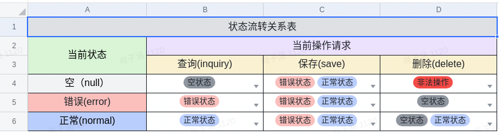
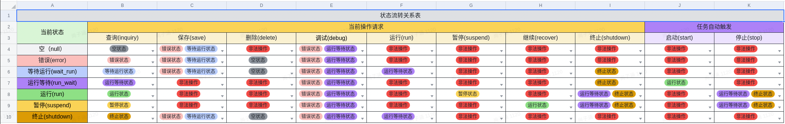
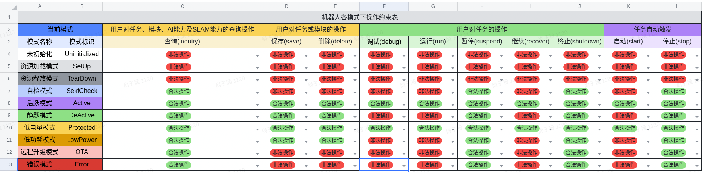

# cyberdog visual programming engine
## 许可证（License）
```
Copyright (c) 2023 Beijing Xiaomi Mobile Software Co., Ltd. All rights reserved.

Licensed under the Apache License, Version 2.0 (the 'License');
you may not use this file except in compliance with the License.
You may obtain a copy of the License at

    http://www.apache.org/licenses/LICENSE-2.0

Unless required by applicable law or agreed to in writing, software
distributed under the License is distributed on an 'AS IS' BASIS,
WITHOUT WARRANTIES OR CONDITIONS OF ANY KIND, either express or implied.
See the License for the specific language governing permissions and
limitations under the License.
```
## 概述
当前项目为 cyberdog 可视化编程项目，用于提供 cyberdog 引擎。

## 模块架构

<center>



</center>

如上图所示，可视化编程引擎模块架构：
1. 核心功能：
    * 解析及响应前端消息；
    * 请求及处理后端消息；
    * 构造及注册模块或任务；
    * 控制任务运行。
2. 任务操作及模块操作参见任务及模块状态流转。

#### 机器人端-模块操作及状态流转设计

<center>



</center>

如上表所示，三种模块状态分别在三种模块操作下的流转关系尽收眼底，现对三种模块操作及三种模块状态进行说明如下：
* 三种模块操作
    1. 保存任务：构建当前id的模块，若模块id已存在则覆盖，并审核任务语法是否合规，反馈操作结果。
    2. 查询任务：查询当前id对应的模块，反馈操作结果。
    3. 删除任务：审核当前id对应的模块是否可以删除，若可以则删除当前id对应的模块，反馈操作结果。
* 三种模块状态
    1. 空状态：该状态是指没有当前模块的任何状态，本质为当前模块不存在，也就是说任何未记录的模块的状态均为空状态。
    2. 错误状态：该状态是指当前模块不符合语法规则，也就是说当前模块无法运行只能再次编辑。
    3. 正常状态：该状态是指当前模块符合语法规则，也就是说当前模块可以调用。

#### 机器人端-任务操作及状态流转设计

<center>



</center>

如上表所示，七种任务状态分别在八种任务操作下的流转关系尽收眼底，现对八种任务操作及七种任务状态进行说明如下：
* 八种任务操作
    1. 保存任务：构建当前id的任务，若任务id已存在则覆盖，并审核任务语法是否合规，反馈操作结果。
    2. 运行任务：运行当前id对应的任务，若任务id对应的任务不存在或语法状态错误则不执行，反馈操作结果。
    3. 查询任务：查询当前id对应的任务，反馈操作结果。
    4. 删除任务：删除当前id对应的任务，反馈操作结果。
    5. 暂停任务：暂停当前id对应的任务，反馈操作结果。
    6. 继续任务：继续当前id对应的任务，反馈操作结果。
    7. 终止任务：终止当前id对应的任务，反馈操作结果。
    8. 调试任务：以当前调试id为基础，保存、审核及运行当前帧携带的逻辑，反馈操作结果。
* 七种任务状态
    1. 空状态：该状态是指没有当前任务的任何状态，本质为当前任务不存在，也就是说任何未记录的任务的状态均为空状态。
    2. 错误状态：该状态是指当前任务不符合语法规则，本质为当前任务不合规，也就是说当前任务无法运行只能再次编辑。
    3. 等待运行状态：该状态是指当前任务可以运行但尚未加入任务注册表中，本质为当前任务语法规则，也就是说当前任务处于等待用户确认运行状态。
    4. 运行等待状态：该状态是指当前任务已加入任务注册表中，但尚未满足运行条件，本质为当前任务语法规则，且正在等待运行条件满足后即刻运行的状态。
    5. 运行状态：该状态是指当前任务已满足执行条件，正在执行内部逻辑的状态。
    6. 暂停状态：该状态是指当前任务处于暂停执行的状态，此时任务进程任在，可以是断点暂停或用户手动暂停正在执行的任务。
    7. 终止状态：该状态是指当前任务被终止执行，此时不存在任务进程，可以是正常执行结束或被迫终止任务。
* 注意：当前的任务状态是基于任务内编程逻辑考虑，不做任务执行约束条件考虑（由调用方考虑）：
* 当某条任务内编程逻辑审核通过，该任务状态即为等待运行（wait_run）状态，若该任务执行约束条件为定时单次执行时，需要调用方根据定时约束判断当前任务的约束时间是否已过期，当未过期时再开启任务。当然，也可以不用管，直接下发开启请求，但是会被视为非法请求，操作会失败，对用户操作体验不友好。

#### 机器人端-状态机各模式下操作约束设计

<center>



</center>

如上表所示，十种机器人模式下用户对任务或模块的八种操作，用户对AI能力的一种操作以及任务自行触发的两种操作约束条件尽收眼底，各模式下的约束指标主要考虑如下：
1. Uninitialized、SetUp、TearDown三种模式下，机器人各功能模块均处于无法正常工作的状态，故而限制所有操作；
2. SekfCheck、OTA以及Error模式下，机器人各功能模块均处于封闭状态，故而限制所有可能导致图形化编程新增进程的操作，只允许现有进程自动停止（stop）或用户手动暂停（suspend）或终止（shutdown）现有进程，允许查询（inquiry）是想为用户提供展示任务、模块及AI信息，为用户的暂停（suspend）或终止提供基础，同时也支持二次编辑任务或模块的功能，提升用户和机器人互动过程中的异步体验（不会因自检阻塞用户编程），该思想同样适用于Active、DeActive、Protected、LowPower、OTA以及Error模式；
3. Active模式下，机器人各功能模块均处于能够正常工作的阶段，故而开放所有操作；
4. Protected模式下，机器人大部分功能模块均处于能够正常工作的阶段，故而开放所有操作，该模式下受限功能如下：
    * 运动模块：除站立、趴下外的所有结果指令；
    * LED模块：BMS会抢占LED设备。
5. DeActive以及LowPower模式下，机器人各功能模块均处于休眠状态，查询（inquiry）、停止（stop）及暂停（suspend）或终止（shutdown）约束考虑和SekfCheck模式一样，对于保存（save）和删除（delete）操作的考虑和查询一样，也是想为用户提供展示任务、模块及AI信息，为用户的暂停（suspend）或终止提供基础，同时也支持二次编辑任务或模块的功能，提升用户和机器人互动过程中的异步体验（不会因自检阻塞用户编程）。

<details>
  <summary><font color=red size=4> 注意 </font></summary>
  <pre><blockcode>🟥 低电量模式：
    🔵 进入：
        🔺电量低于20%，自动进入；
    🟠 退出：
        🔺电量大于等于20%，自动退出；
🟩 低功耗模式
    🔵 进入：
        🔺电量小于5%时自动进入低功耗；
        🔺趴下超过30s，进入低功耗；
        🔺唤醒退出低功耗模式后，若30s内未进行运动控制，则再次进入低功耗模式；
    🟠 退出：
        🔺语音唤醒：“铁蛋、铁蛋”；
        🔺app端点击退出低功耗；
        🔺双击狗头退出低功耗；</blockcode></pre>
</details>
