# cyberdog visual programming terminal
## 许可证（License）
```
Copyright (c) 2023 Beijing Xiaomi Mobile Software Co., Ltd. All rights reserved.

Licensed under the Apache License, Version 2.0 (the 'License');
you may not use this file except in compliance with the License.
You may obtain a copy of the License at

    http://www.apache.org/licenses/LICENSE-2.0

Unless required by applicable law or agreed to in writing, software
distributed under the License is distributed on an 'AS IS' BASIS,
WITHOUT WARRANTIES OR CONDITIONS OF ANY KIND, either express or implied.
See the License for the specific language governing permissions and
limitations under the License.
```
## 概述
> 当前项目为 cyberdog 可视化编程项目，用于提供 cyberdog 终端。

## 模块架构

<center>



</center>

如上图所示，可视化编程铁蛋能力集模块架构：
* 2种能力：
    1. 终端下交互式编程：基于Python API实现终端编程，用于高级玩家，同时也是研发过程中脱离APP进行Python API的调试工具。
    2. 终端下调试工具：主要调试图形化编程引擎和机器人能力集C++ API，同时提供了终端下的API帮助文档功能。